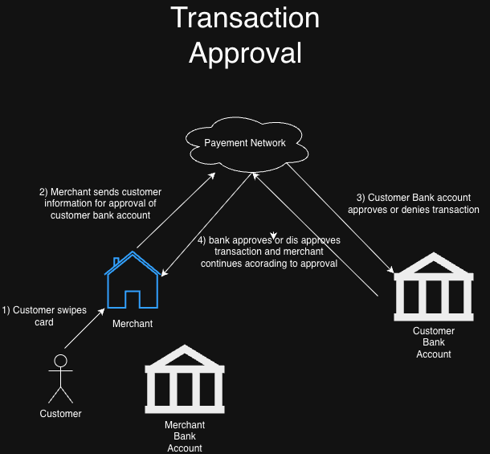
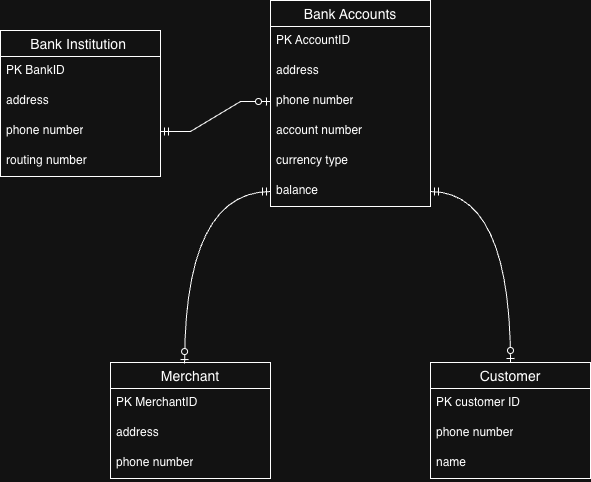
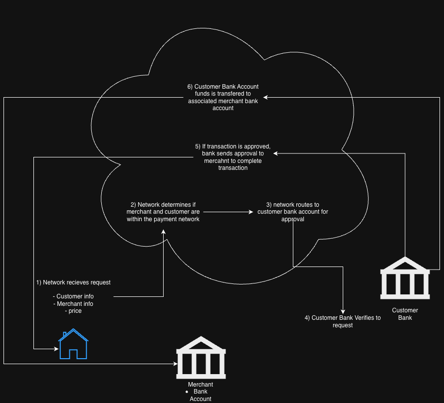
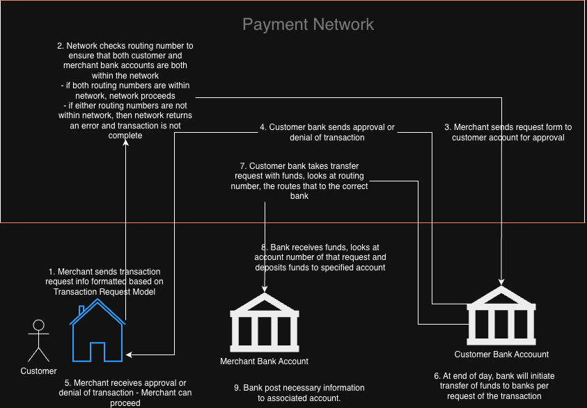

# Payment-System
# Who is this projet for
This project is meant for ethusiast that are interested in how payment systems work. This project deomonastates the real world sact of transaction and currency movement.
# Transaction Approval Process

# Currency movement Process

# Class Diagram

# What does the payment network do
1. routes tracations
2. handles clearing and settling
3. approves the transaction (gives transaction request to banks and returns them to merchants)

# How are transactions routed
Within the payment system, we need bank accounts that are part of the payment network
    - banks can register through a process through an admin portal of the network
The network looks for the bank through the routing number, this is the main identifer for request.
Once the network finds the bank, the network checks if the merchant has a qualifying bank, meaning the bank is within the network.
Once both banks are confirmed that they are in the network, the request for the transaction is sent to the customers bank account.
Bank validates the customer and verifies the transaction.
Once approved or dis approved, the bank send sover confirmation to the merchant to finish the transaction.
If approved, the bank wll transfer the funds throgh the network either instantly or at the end of the day
## what is needed for transactions to be approved?
- Customers
 - routing number
 - account number
- merchant
 - routing number
 - account number
- transaction details
 - price
Transactions are approved based on if the customer bank is within network, the balance is more than the amont of the purchase, and if the merchant bank account is within network 

# Payment System
## During the transaction
Durig a transaction, the merchant send information to the network. This includes merchant information like bank account, price, and customer informaion.
### steps
1. network should determine if customer bank AND merchant bank are part of the payment network
 - the netowrk cn do this by searching its internal database to see if banks are held within the system
 - if the network finds that eithier entities do not have a bank within the system, the system returns the necessary info
2. Once both banks are verfified, the network routes the transaction request to the customer bank
3. here, the bank verfies if the request is valid, meaning the price is well below the balance of the customr, the transaction is not fraudulent, and other necessary requirments
4. approvals or dis approvals are sent back to the merchant to complete transaction.

## Money Movement
Once a transaction is approved, then currency movement from one bank to another can be initiated.
## Banks
In this project, banks are held in classes seperate from the project. Banks have the following information,
`
{
  "bankId": 1,
  "bankName": "First National Bank",
  "address": "123 Main St, Springfield, USA",
  "phonenumber": "806-444-3333"
  "routingNumber": 111000025,
}
`
# Development
## Sending transaction request though network to customer bank account
### Requesting a transaction
- information needed to send for the request
    1. price
    2. customer bank info
        - routing number
        - acciunt number
    3. merchant bank account
        - routing number
        - account number
- example JSON that merchant sends for transaction
    `
    {
    "merchantId": 12345,
    "sourceRoutingNumber": 111000025,
    "sourceAccountNumber": 987654321,
    "destinationRoutingNumber": 222000111,
    "destinationAccountNumber": 123456789,
    "amount": 150.75,
    "date": "2026-04-16T14:30:00Z",
    }
    `
- Procedures of determining if a transaction can be approved or denied
1. Merchant sends information that is in the JSON
2. information in the JSON is stored in a `transaction request` model. This acts a card for request. Necessary info is now stored in a card and now it can be proccessed
3. network checks if routing numbers are part of the payment network
4. once it is confirmed that the routing of both customer and merchant are within the payment system system routes card(model) to the customers bank for approval of the request.
5. Bank of the customer approves or denies the request.
6. Bank sends approval or denial of the transaction through the network to the merchant.

# Bank entities
banks should have 2 programs, a program that holds the banking system that handles routing, authentification, and authorization for transaction request for custimer and merchnt bank accounts and an admin portal where admins can add bank accounts, create customer user, create admin users, and modify said users.

# Updated Transaction Flow

# Payment Network Design
## API Endpoint requirments
1. API should take in transaction of merchants with valid bank account
2. API should look at customer routing number and route transaction request to right bank
3. API should take approval/denial of request from customer bank and route message back to the merchant
4. API should act as a highway for fund transfers
    - API should take transfer request from bank including the destination of funds and funds itself and route it to the correct bank institution

# JSON formatting
All JSON responses should include status, success(T/F), and a message

# Adding Banks to network
when banks are created, they need to choose a payment facilitator. Banks can talk to a representative and register their bank in the network. This is usually done by cost but it is free for now.